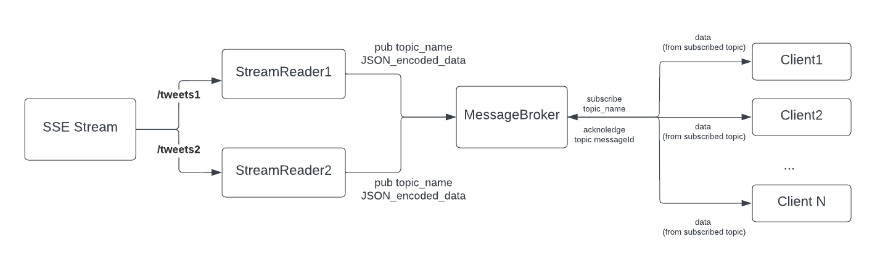
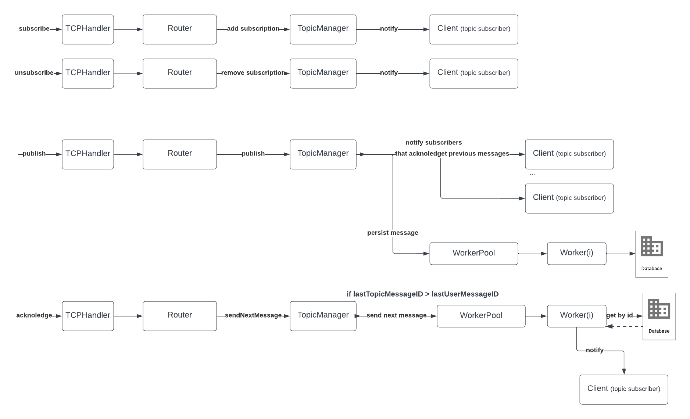

# Message Broker

The message broker manages communication between producers and consumers. The message broker has support for multiple topics and have the possibility to subscribe and unsubscribe dynamically.

## General message flow

Bellow is shown the general message flow diagram.



The events emitted by the SSE Stream are being read by the stream readers and published to the corresponding topic of the message broker. The message broker redirects the message
to the clients subscribed to that topic.


## Message flow by commands

In the diagram below, the message flow is represented for each supported command.



The publish command is being sent by the stream readers. After it's parsed inside the TCP connection handler, the router receives the corresponding message and
notifies the topic supervisor about it. The message is sent to the topic subscribers which have acknoledged all of the previous messages, and persisted inside the database (to be able
to notify the other subscribes and those who have been temporarily disconnected as soon as they restore the access.

The clients can send subscribe, unsubscribe and acknoledge commands. In the case of the first two commands, they are being parsed inside the TCP connection handler, after which, the result
is sent to the router the topic manager. The topic manager keeps track about all subscribers. The acknoledge command is sent by the clients after receiving a message from the 
message broker. In this case, the topic supervisor verifies whether there are some additional pending topic message not sent to the client. In this case, the message is being retrieved 
from the database.

### Main Actors
```TCPConnectionHandler``` - represents the connection to the server for each separate client. Inside the handler, the received data is parsed into 3 parts: command, topic, payload - after which, it's being sent to the router.</br>
```Router``` - the router selects the topic manager for the received command and sends it the message</br>
```TopicManager``` - topic manager actor handles publish, subscribe, unsubscribe and sendNextMessage messages. It keeps track of all of the subscribers to the given topic, as well as the last subscriber acknoledged message.</br>
```WorkerPool``` - worker pool actor maintains the connection to the database and handles the redirection of the messages to the workers using Round Robin method.</br>
```Worker``` - worker actor implements the logicof saving and retrieving the data from the database. It uses the connection maintained by the parent actor.
